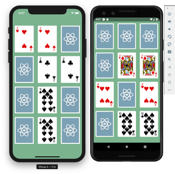

## React Native Game App

A simple cross platform (iOS and Android) React Native game. This example was put together for [React Native by Example](https://www.reactnativebyexample.com/). Get started learning & mastering React Native for free!

### Installation

- `git clone https://github.com/ReactNativeSchool/react-native-review-app.git`
- `yarn install`/`npm install`

*Note: The `finished` branch contains the final code of the game. So, `git checkout finished` would help you retrieve the final code.*

### Running

- `yarn run ios`/`npm run ios` or `yarn run android`/`npm run android`

---

This project was put together to serve as an example to help you in building your own React Native apps. Feel free to download it and tinker with it!
